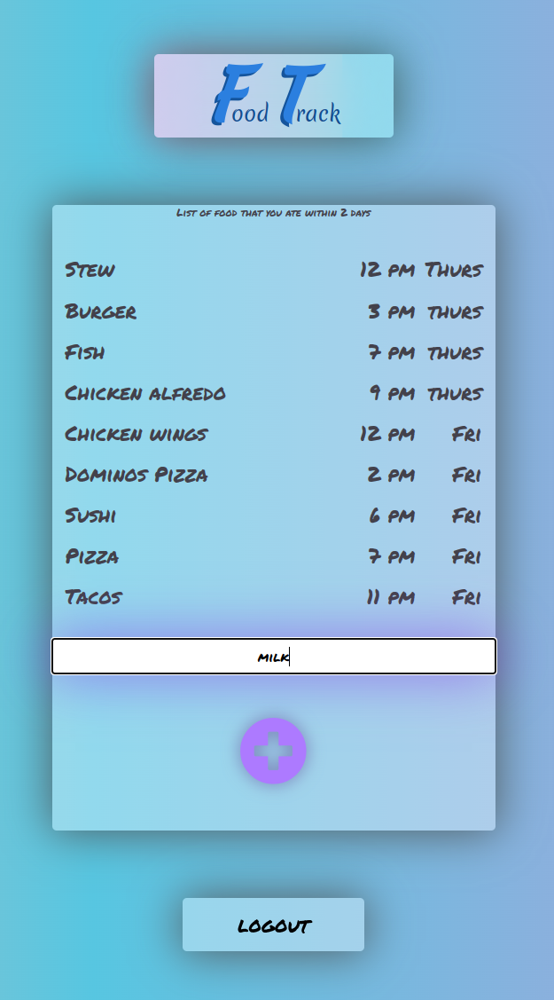

# FoodTrack
## Summary: The purpose of this app is to track food that you consumed and lists everything you ate within 2 days. If 'REACTION' button is pressed, it tells the app that something you ate within 2 days caused a reaction and gives the list of food you ate within 2 days.

## Objective: I wanted to learn about CRUD operations and MongoDB database. I also learned different encryptions for making accounts to store in the Appilications Database by using Passport Oauth.

# Demo: https://foodtrack2022.herokuapp.com/
### Web view
  

### Mobile view
  

## Instructions:
Login thru socials  
  
or Register  

Add items by Typing the food and pressing "+"  

Delete items by highlighting item/s and pressing "-"  
  

## Keep in mind: These datas are stored in a Database, so you can come back anytime.  

For more, email me at aldwindrodriguez@gmail.com
